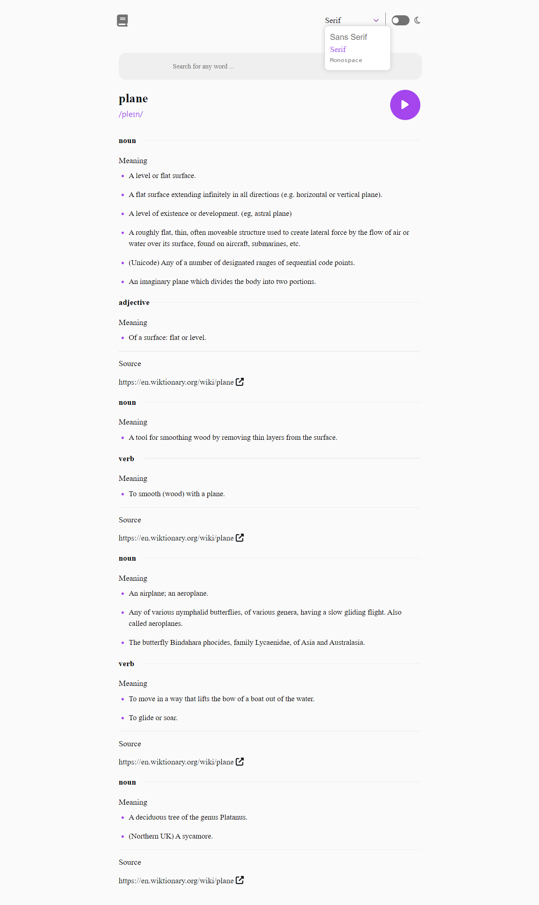
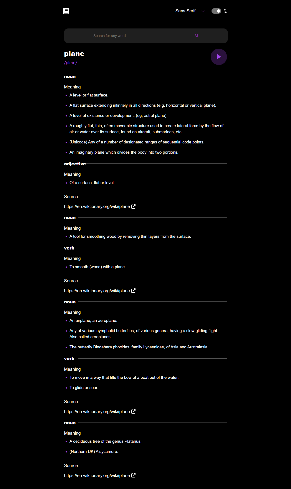

# Dictionary Web App API with color theme switcher

Welcome to the Dictionary Web App repository! 📚 This project is a React application that provides users with a comprehensive dictionary experience, powered by the Dictionary API. With this web app, users can easily look up definitions, synonyms, antonyms, and examples of words, making it a valuable tool for students, writers, and language enthusiasts alike.
## Table of contents

- [Overview](#overview)
  - [The challenge](#the-challenge)
  - [Features](#features)
  - [Screenshot](#screenshot)
  - [Links](#links)
- [My process](#my-process)
  - [Built with](#built-with)
- [Author](#author)
- [Installation](#installation)

## Overview

### The challenge

Users should be able to:

- Search for words using the input field
- See the Free Dictionary API's response for the searched word
- See a form validation message when trying to submit a blank form
- Play the audio file for a word when it's available
- Switch between serif, sans serif, and monospace fonts
- Switch between light and dark themes
- View the optimal layout for the interface depending on their device's screen size
- See hover and focus states for all interactive elements on the page

### Features
- Search for word definitions, synonyms, antonyms, and examples.
- User-friendly interface for easy navigation and exploration of word meanings.
- Responsive design ensures optimal viewing experience across different devices.

### Screenshot

### Links

- Live Site URL: [https://dictionary.vercel.app/](https://dictionary.vercel.app/)

## My process

### Built with

- HTML
- CSS custom properties
- Flexbox
- Mobile-first workflow
- [React](https://reactjs.org/) - JS library
- it is a [Progressive Web App](https://facebook.github.io/create-react-app/docs/making-a-progressive-web-app)
- Free [Dictionary API](https://dictionaryapi.dev/)
- [React Font Awesome](https://fontawesome.com/v5/docs/web/use-with/react)

## Author

- Portfolio - [Unlisted](https://portfolio-unlisted.vercel.app)
- Github - [Unlisted](https://github.com/unlisted02)

## Installation

- clone the repo `git clone https://github.com/unlisted02/dictionary-web-app.git`.
- install dependencies `npm install`.
- start project with `npm start`.
- it can be viewed in the browser at `http://localhost:3000`.
- build the app for production to the `build` folder.\ `npm run build`.
